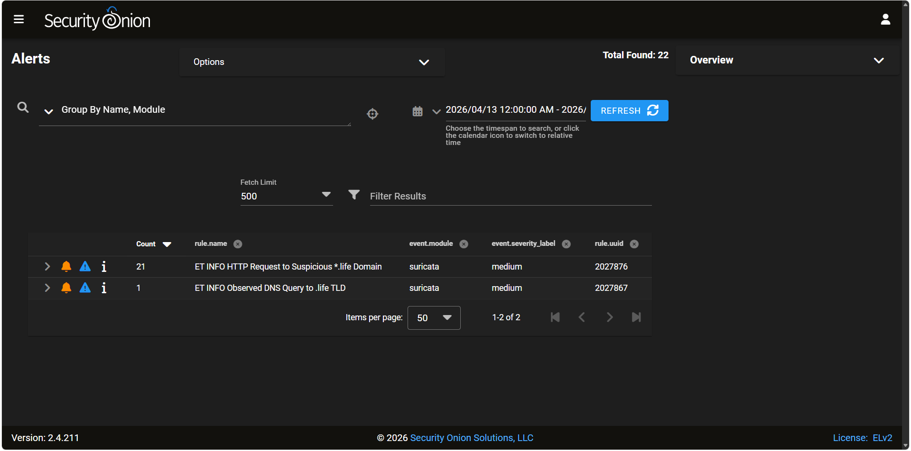
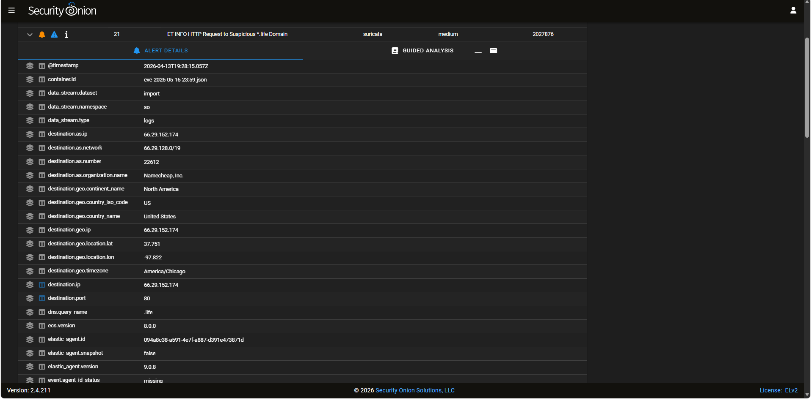
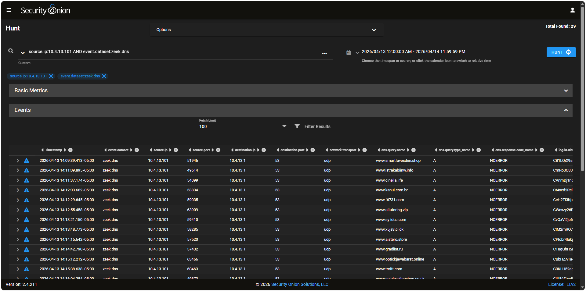
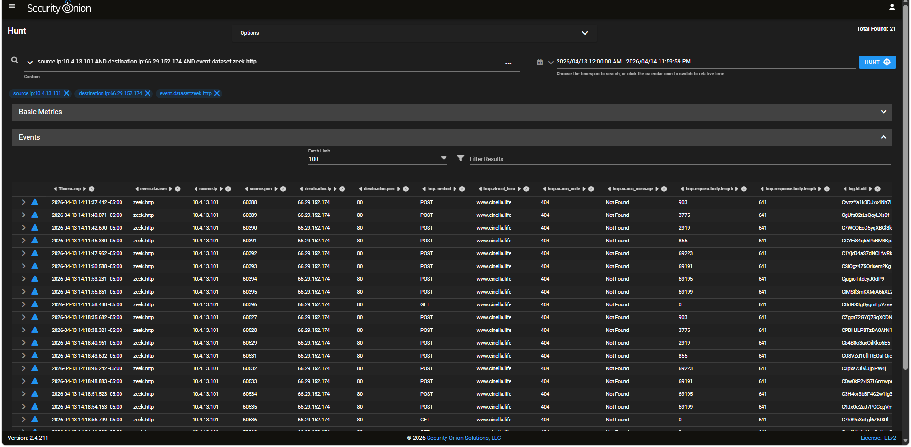
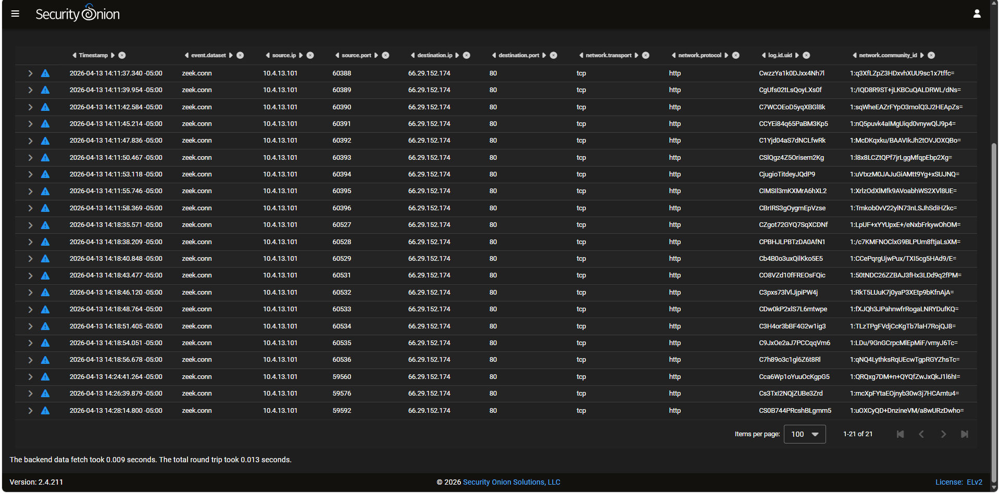
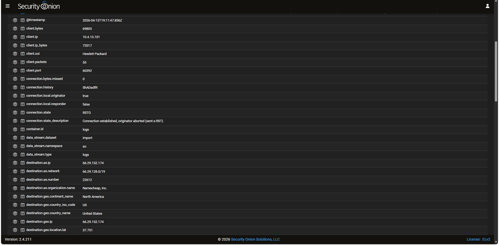
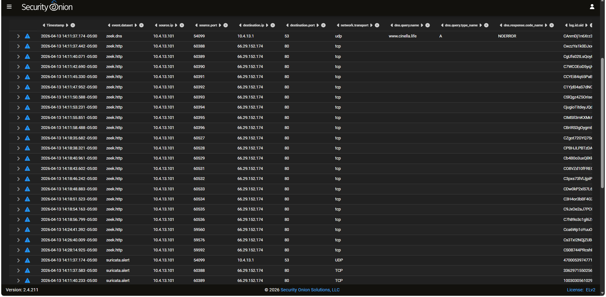

# Investigation 001 - 2026-04-13 XLoader/FormBook Traffic Analysis

## Summary

This investigation reviews a PCAP associated with an XLoader/FormBook infection from Malware-Traffic-Analysis.net. The PCAP was imported into Security Onion and reviewed using Suricata alerts and Zeek network logs.

Security Onion evidence identified `10.4.13.101` as the suspected infected host. The host generated DNS queries for multiple suspicious-looking domains and made repeated HTTP connections to `www.cinella.life` at `66.29.152.174` over TCP port 80.

The strongest finding was repeated HTTP `POST` activity from `10.4.13.101` to `www.cinella.life`, including several POST requests with request body sizes around 69 KB and small server responses. This behavior is consistent with malware post-infection communication, encoded host data submission, or C2-style check-in activity.

This investigation does not independently prove full file exfiltration, but the evidence supports treating `10.4.13.101` as compromised within the context of this PCAP.

---

## Investigation Details

| Item | Value |
|---|---|
| Investigation | 001 |
| Date of PCAP Activity | 2026-04-13 |
| Malware Family / Case | XLoader / FormBook |
| Tooling | Security Onion, Suricata, Zeek |
| Suspected Infected Host | `10.4.13.101` |
| DNS Server | `10.4.13.1` |
| Key Domain | `www.cinella.life` |
| Key Destination IP | `66.29.152.174` |
| Destination Port | TCP/80 |
| Protocol | HTTP |
| Primary Alert Type | Suspicious `.life` domain activity |

---

## Evidence Overview

Security Onion generated 22 Suricata alerts during the investigation window:

- 21 alerts for `ET INFO HTTP Request to Suspicious *.life Domain`
- 1 alert for `ET INFO Observed DNS Query to .life TLD`

An expanded Suricata alert showed traffic from `10.4.13.101` to `66.29.152.174:80` matching the Emerging Threats rule `ET INFO HTTP Request to Suspicious *.life Domain`.

---

## DNS Analysis

Zeek DNS logs showed that `10.4.13.101` queried 29 domains during the investigation window. One key query was for `www.cinella.life`, which occurred immediately before repeated HTTP activity to `66.29.152.174:80`.

Other observed domains included `.shop`, `.info`, `.vip`, `.click`, `.ru`, `.online`, `.xyz`, and other unusual or suspicious-looking domains.

This DNS activity supports the assessment that `10.4.13.101` was the primary host involved in the suspicious post-infection traffic.

---

## HTTP Analysis

Zeek HTTP logs showed 21 HTTP events from `10.4.13.101` to `66.29.152.174:80` using the host `www.cinella.life`.

The HTTP activity included repeated `POST` requests followed by several `GET` requests. Multiple POST requests contained large request body sizes:

| Timestamp | Method | Host | Request Body Length | Response Body Length | Status |
|---|---|---|---:|---:|---|
| 2026-04-13 14:11:47 | POST | `www.cinella.life` | 69,223 | 641 | 404 Not Found |
| 2026-04-13 14:11:50 | POST | `www.cinella.life` | 69,191 | 641 | 404 Not Found |
| 2026-04-13 14:11:53 | POST | `www.cinella.life` | 69,195 | 641 | 404 Not Found |
| 2026-04-13 14:11:55 | POST | `www.cinella.life` | 69,199 | 641 | 404 Not Found |
| 2026-04-13 14:18:46 | POST | `www.cinella.life` | 69,223 | 641 | 404 Not Found |
| 2026-04-13 14:18:48 | POST | `www.cinella.life` | 69,191 | 641 | 404 Not Found |
| 2026-04-13 14:18:51 | POST | `www.cinella.life` | 69,195 | 641 | 404 Not Found |
| 2026-04-13 14:18:54 | POST | `www.cinella.life` | 69,199 | 641 | 404 Not Found |

This POST pattern is notable because normal web browsing often involves smaller client requests and larger server responses. In this case, the suspected infected host repeatedly sent larger HTTP POST bodies to suspicious `.life` infrastructure and received small responses.

---

## Connection Review

Zeek connection logs showed 21 HTTP connection records from `10.4.13.101` to `66.29.152.174:80`.

One expanded Zeek connection event showed:

| Field | Value |
|---|---|
| Client IP | `10.4.13.101` |
| Destination IP | `66.29.152.174` |
| Destination Port | `80` |
| Client Bytes | `69,805` |
| Client Packets | `55` |
| Connection State | `RSTO` |
| Connection State Description | Connection established, originator aborted / sent RST |

The connection metadata supports an outbound-heavy traffic pattern from the suspected infected host to the external destination.

---

## Domain Correlation

A Security Onion Hunt search for `www.cinella.life` correlated DNS, HTTP, and Suricata evidence in one view.

The correlation showed:

1. A Zeek DNS query from `10.4.13.101` for `www.cinella.life`
2. Zeek HTTP traffic from `10.4.13.101` to `66.29.152.174:80`
3. Suricata alerts tied to the same host and suspicious `.life` domain activity

This provides a clear investigation chain from DNS resolution to HTTP communication to alerting.

---

## Findings

### Finding 1 - Suspected Infected Host Identified

Security Onion evidence identified `10.4.13.101` as the suspected infected host. The host was associated with DNS queries, HTTP traffic, Zeek connection logs, and Suricata alerts during the imported PCAP time window.

### Finding 2 - Suspicious `.life` Domain Activity

Suricata generated alerts for suspicious `.life` domain activity. The key domain observed during the investigation was `www.cinella.life`.

### Finding 3 - Repeated HTTP POST Activity

Zeek HTTP logs showed repeated HTTP POST requests from `10.4.13.101` to `www.cinella.life` at `66.29.152.174:80`. Several POST requests contained approximately 69 KB request bodies and received small 641-byte responses.

### Finding 4 - Outbound-Heavy Connection Pattern

Zeek connection metadata showed outbound-heavy HTTP traffic from the suspected infected host to the suspicious destination. One expanded connection showed `69,805` client bytes and a `RSTO` connection state.

---

## Analyst Assessment

The evidence supports that `10.4.13.101` was the suspected infected host in this PCAP. Security Onion identified repeated Suricata alerts for suspicious `.life` domain HTTP activity, Zeek DNS logs showed the host querying `www.cinella.life` and other suspicious domains, and Zeek HTTP logs showed repeated POST requests to `www.cinella.life` at `66.29.152.174:80`.

Several POST requests contained large request bodies of approximately 69 KB while receiving small 641-byte responses. This pattern is consistent with malware post-infection communication, encoded host data submission, or C2-style check-in behavior.

The evidence does not independently prove full file exfiltration, but it is strong enough to treat the host as compromised within the context of the PCAP.

---

## Supporting Files

- [Security Onion Queries](queries.md)
- [Indicators CSV](indicators.csv)
- Screenshots: `screenshots/`
